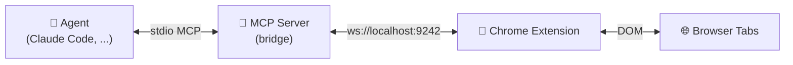
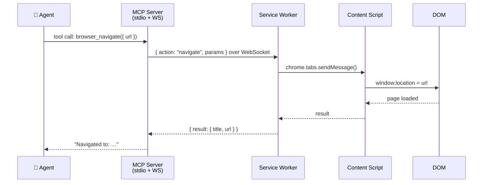

# agent-browser-bridge

> An [MCP](https://modelcontextprotocol.io) server that lets any MCP-compatible coding agent — Claude Code, Claude Desktop, Cursor, and others — control your real browser. Navigate, click, type, read, screenshot, run JS — all over a local WebSocket bridge to a Chrome extension.



## What it does

You're coding in Claude Code (or any MCP client). You need the agent to fill a form, scrape a dashboard, or test a web app. Instead of copy-pasting between tools, it just does it — in **your actual browser**, where you're already logged in:

```ts
browser_navigate({ url: "https://github.com/issues" })
browser_type({ selector: "#search", text: "bug", submit: true })
browser_read({ selector: ".issue:first-child" })
browser_screenshot({ format: "png" })
```

No Playwright. No Puppeteer. No fresh headless profile. Just a Chrome extension and a Bun-based MCP server.

## Quick start

**Prerequisites:** [Bun](https://bun.com) v1.3+, Chrome 120+, [Claude Code](https://claude.com/claude-code) (or another MCP client)

```bash
# 1. Clone & install
git clone https://github.com/vzsoares/agent-browser-bridge.git
cd agent-browser-bridge && bun install

# 2. Build & load the Chrome extension
cd chrome-extension && bun run build
# → chrome://extensions → "Load unpacked" → select chrome-extension/dist/

# 3. Register the MCP server with Claude Code
claude mcp add --transport stdio --scope user agent-browser-bridge \
  -- bun /absolute/path/to/agent-browser-bridge/bridge/src/mcp/server.ts
```

Open Claude Code — the extension badge turns 🟢 green when connected, and the 11 `browser_*` tools are available.

## What the agent can do

**Navigate & inspect**
```ts
browser_navigate({ url: "https://example.com" })
browser_screenshot({ fullPage: true })
browser_read({ selector: "main" })
```

**Interact with pages**
```ts
browser_click({ selector: "button", text: "Accept" })
browser_type({ selector: "#email", text: "hello@example.com", submit: true })
```

**Wait for stuff**
```ts
browser_wait_for_element({ selector: ".loaded", timeout: 5000 })
browser_wait_for_text({ text: "Success" })
```

**Run arbitrary JS**
```ts
browser_exec({ code: "document.querySelectorAll('a').length" })
```

**Manage tabs**
```ts
const tab = browser_create_tab({ url: "https://example.com" })
browser_list_tabs({ urlPattern: "github.com" })
browser_close_tab({ tabId: tab.tabId })
```

[Full API reference →](./docs/api.md)

## Multi-tab support

Multiple agents (or multiple sessions of the same agent) can drive separate tabs in parallel without stepping on each other or the user's own browsing.

Each browser tool accepts an optional `tabId`. When `tabId` is omitted:

| Action | Default behaviour |
|--------|------------------|
| `browser_navigate` | **Creates a new tab** and navigates there |
| All other tools | Target the **active tab** |

Every response includes the `tabId` the action ran against, so the agent can track which tab is theirs.

### Tab management tools

| Tool | Parameters | Returns |
|------|-----------|---------|
| `browser_create_tab` | `url?` (blank if omitted) · `active?` (default `true`) | `{ tabId, url, title }` |
| `browser_list_tabs` | `urlPattern?` · `currentWindowOnly?` (default `true`) | `[{ tabId, url, title, active }]` |
| `browser_close_tab` | `tabId` (required) | `{ closed: true }` |

If a specified `tabId` no longer exists (the tab was closed), the tool returns a `TAB_NOT_FOUND` error.

### ⚠️ Screenshot limitation

`browser_screenshot` uses Chrome's `captureVisibleTab` API, which can only capture the **active tab in the focused window**. Passing a `tabId` to screenshot a background tab is not supported. To screenshot a specific tab, bring it to the front first.

## How it works



Four pieces: a **Bun MCP server** (stdio to the agent), a **WebSocket relay** (server ↔ extension), a **Chrome extension** (service worker + content script), and a shared **protocol** (types, no runtime).

Everything stays on `localhost`. No cloud, no accounts, no telemetry.

## Configuration

| Variable | Default | What |
|---|---|---|
| `AGENT_BROWSER_PORT` | `9242` | WebSocket port |
| `AGENT_BROWSER_BRIDGE_LOG_LEVEL` | `silent` | `debug` / `info` / `warn` / `error` / `silent` |

The extension popup lets you toggle the bridge on/off and restrict which domains the agent can touch. Default: `*` (all domains).

## Security

- **localhost only** — no network exposure
- **Domain allowlist** — restrict which sites the agent can control
- **Isolated content script** — page JS can't touch extension internals
- **Minimal permissions** — `activeTab`, `scripting`, `storage`, `tabs`

## How it compares

Those are great tools. This one makes a different trade-off:

| | Playwright / Puppeteer | [chrome-devtools-mcp](https://github.com/ChromeDevTools/chrome-devtools-mcp) | agent-browser-bridge |
|---|---|---|---|
| Browser | Launches a separate instance | Launches its own Chrome by default (can attach to a running one with `--browser-url` / `--autoConnect`) | **Your actual browser** (extension already inside it) |
| Auth | Must handle cookies / sessions manually | Dedicated profile by default; can use your existing profile when attaching to running Chrome | **You're already logged in** |
| API surface | DOM-level scripting | Full Chrome DevTools Protocol — performance tracing, network inspection, debugging | DOM-level: `browser_navigate`, `browser_click`, `browser_type`, `browser_read`, `browser_exec`, multi-tab… |
| Agent integration | None — wrap it yourself | MCP server (Node.js) | MCP server (Bun) |
| Setup | `npm install` + a browser binary | `npx`, plus (typically) a Chrome 144+ launch flag for auto-attach | Load a Chrome extension + `claude mcp add …` |
| Telemetry | None (depends on the test harness) | **On by default** — Google collects tool invocation success rates, latency, and environment info; opt out with `--no-usage-statistics` or `CHROME_DEVTOOLS_MCP_NO_USAGE_STATISTICS=1`. Performance tools may send trace URLs to the Google CrUX API. | **None.** Everything stays on `localhost` — no analytics, no phone-home, no third-party endpoints |
| Best for | Headless test suites / CI | Deep diagnostics, performance audits, DevTools-style debugging from an agent | "Drive my real browser as me" — scraping behind auth, multi-tab agent workflows, working with your own session |

Use agent-browser-bridge when you want the agent to interact with the web *as you*. Reach for [chrome-devtools-mcp](https://github.com/ChromeDevTools/chrome-devtools-mcp) when you want full DevTools / CDP power. Reach for Playwright/Puppeteer for hermetic, CI-grade automation.

## License

MIT
