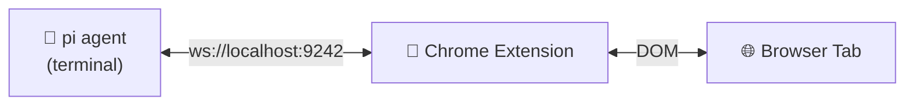
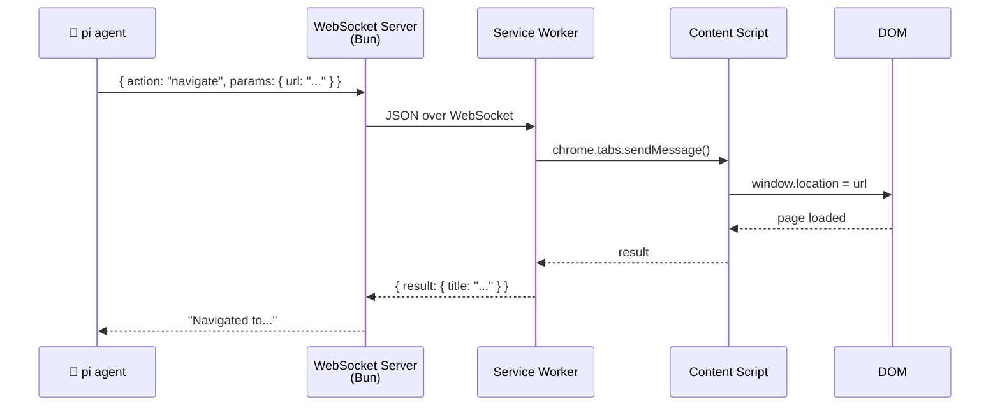

# pi-browser-bridge

> Let your [pi](https://github.com/mariozechner/pi) coding agent control the browser. Navigate, click, type, read, screenshot — all from the terminal, all over a local WebSocket.



## What it does

You're coding with pi in the terminal. You need it to fill a form, scrape a dashboard, or test a web app. Instead of copy-pasting between tools, pi just does it:

```ts
// pi navigates to GitHub, searches for an issue,
// reads the first comment, and screenshots it — all from the terminal

browser_navigate({ url: "https://github.com/marco-souza/pi-browser-bridge/issues" })
browser_type({ selector: "#search", text: "bug", submit: true })
browser_read({ selector: ".issue:first-child" })
browser_screenshot({ format: "png" })
```

No Selenium. No Puppeteer. Just a Chrome extension and a Bun server.

## Quick start

**Prerequisites:** [Bun](https://bun.com) v1.3+, Chrome 120+

```bash
# 1. Clone & install
git clone https://github.com/marco-souza/pi-browser-bridge.git
cd pi-browser-bridge && bun install

# 2. Build & load the Chrome extension
cd chrome-extension && bun run build
# → chrome://extensions → "Load unpacked" → select chrome-extension/dist/

# 3. Start the bridge
bun run index.ts

# 4. Register in your pi config
# pi.register(await import("@pi-browser-bridge/pi-extension"))
```

That's it. The extension badge turns 🟢 green when connected.

## What pi can do

**Navigate & inspect**
```ts
browser_navigate({ url: "https://example.com" })
browser_screenshot({ fullPage: true })
browser_read({ selector: "main" })
```

**Interact with pages**
```ts
browser_click({ selector: "button", text: "Accept" })
browser_type({ selector: "#email", text: "hello@example.com", submit: true })
```

**Wait for stuff**
```ts
browser_wait_for_element({ selector: ".loaded", timeout: 5000 })
browser_wait_for_text({ text: "Success" })
```

**Run arbitrary JS**
```ts
browser_exec({ code: "document.querySelectorAll('a').length" })
```

[Full API reference →](https://github.com/marco-souza/pi-browser-bridge/blob/main/docs/api.md)

## How it works



Three pieces: a **Bun WebSocket server** (talks to pi), a **Chrome extension** (service worker + content script), and a shared **protocol** (types, no runtime).

Everything stays on `localhost`. No cloud, no accounts, no telemetry.

## Configuration

| Variable | Default | What |
|---|---|---|
| `PI_BROWSER_PORT` | `9242` | WebSocket port |

The extension popup lets you toggle the bridge on/off and restrict which domains it can touch. Default: `*` (all domains).

## Security

- **localhost only** — no network exposure
- **Domain allowlist** — restrict which sites pi can control
- **Isolated content script** — page JS can't touch extension internals
- **Minimal permissions** — `activeTab`, `scripting`, `storage`

## Why not Puppeteer / Playwright?

Those are great tools. This is a different tradeoff:

| | Puppeteer/Playwright | pi-browser-bridge |
|---|---|---|
| Browser | Launches a separate instance | **Your actual browser** |
| Auth | Must handle cookies/sessions manually | **You're already logged in** |
| Setup | npm install + browser binary | A Chrome extension |
| Context | Fresh profile every time | Your bookmarks, extensions, history |

Use pi-browser-bridge when you want pi to interact with the web *as you*.

## License

MIT
