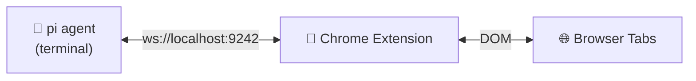
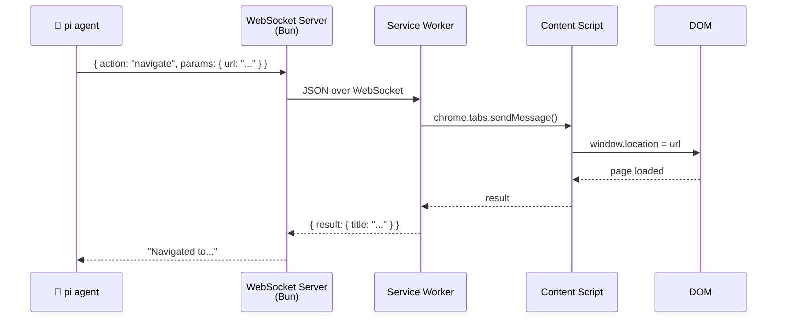

# pi-browser-bridge

> Let your [pi](https://github.com/mariozechner/pi) coding agent control the browser. Navigate, click, type, read, screenshot — all from the terminal, all over a local WebSocket.



## What it does

You're coding with pi in the terminal. You need it to fill a form, scrape a dashboard, or test a web app. Instead of copy-pasting between tools, pi just does it:

```ts
// pi navigates to GitHub, searches for an issue,
// reads the first comment, and screenshots it — all from the terminal

browser_navigate({ url: "https://github.com/marco-souza/pi-browser-bridge/issues" })
browser_type({ selector: "#search", text: "bug", submit: true })
browser_read({ selector: ".issue:first-child" })
browser_screenshot({ format: "png" })
```

No Selenium. No Puppeteer. Just a Chrome extension and a Bun server.

## Quick start

**Prerequisites:** [Bun](https://bun.com) v1.3+, Chrome 120+

```bash
# 1. Clone & install
git clone https://github.com/marco-souza/pi-browser-bridge.git
cd pi-browser-bridge && bun install

# 2. Build & load the Chrome extension
cd chrome-extension && bun run build
# → chrome://extensions → "Load unpacked" → select chrome-extension/dist/

# 3. Start the bridge
bun run index.ts

# 4. Register in your pi config
# pi.register(await import("@pi-browser-bridge/pi-extension"))
```

That's it. The extension badge turns 🟢 green when connected.

## What pi can do

**Navigate & inspect**
```ts
browser_navigate({ url: "https://example.com" })
browser_screenshot({ fullPage: true })
browser_read({ selector: "main" })
```

**Interact with pages**
```ts
browser_click({ selector: "button", text: "Accept" })
browser_type({ selector: "#email", text: "hello@example.com", submit: true })
```

**Wait for stuff**
```ts
browser_wait_for_element({ selector: ".loaded", timeout: 5000 })
browser_wait_for_text({ text: "Success" })
```

**Run arbitrary JS**
```ts
browser_exec({ code: "document.querySelectorAll('a').length" })
```

**Manage tabs**
```ts
const tab = browser_create_tab({ url: "https://example.com" })
browser_list_tabs({ urlPattern: "github.com" })
browser_close_tab({ tabId: tab.tabId })
```

[Full API reference →](https://github.com/marco-souza/pi-browser-bridge/blob/main/docs/api.md)

## Multi-tab support

pi-browser-bridge supports **multi-tab operation** — multiple pi agents can
operate simultaneously in separate browser tabs without interfering with each
other or with the user's own browsing.

### How it works

Each browser tool accepts an optional `tabId` parameter to target a specific
tab. When `tabId` is omitted:

| Action | Default behavior |
|--------|------------------|
| `browser_navigate` | **Creates a new tab** and navigates there |
| All other tools | Targets the **active tab** |

Every response includes the `tabId` of the tab that was operated on, so agents
can track which tab they're working with.

### New tab management tools

| Tool | Parameters | Returns |
|------|-----------|---------|
| `browser_create_tab` | `url?` — URL to open (blank if omitted)<br/>`active?` — make it the foreground tab (default: `true`) | `{ tabId, url, title }` |
| `browser_list_tabs` | `urlPattern?` — filter by URL substring<br/>`currentWindowOnly?` — limit to current window (default: `true`) | Array of `{ tabId, url, title, active }` |
| `browser_close_tab` | `tabId` — tab to close (required) | `{ closed: true }` |

### The `tabId` parameter

All tools accept `tabId?: number` to target a specific tab:

| Tool | `tabId` behavior |
|------|------------------|
| `browser_navigate` | Navigate the given tab in-place. Without `tabId`, creates a new tab. |
| `browser_click` | Click in the given tab. Without `tabId`, clicks in the active tab. |
| `browser_type` | Type in the given tab. Without `tabId`, types in the active tab. |
| `browser_read` | Read from the given tab. Without `tabId`, reads the active tab. |
| `browser_screenshot` | Screenshot the given tab. ⚠️ **v1 limitation**: `tabId` is ignored — always captures the active tab (see below). |
| `browser_exec` | Execute JS in the given tab. Without `tabId`, executes in the active tab. |
| `browser_wait_for_element` | Wait in the given tab. Without `tabId`, waits in the active tab. |
| `browser_wait_for_text` | Wait in the given tab. Without `tabId`, waits in the active tab. |
| `browser_create_tab` | N/A — creates a new tab and returns its `tabId`. |
| `browser_list_tabs` | N/A — lists all open tabs. |
| `browser_close_tab` | `tabId` is required. |

If a specified `tabId` no longer exists (the tab was closed), the tool returns
a `TAB_NOT_FOUND` error.

### ⚠️ Navigate behavior change (breaking)

**Before v2:** `browser_navigate({ url: "..." })` navigated the active tab in-place.

**After v2:** `browser_navigate({ url: "..." })` creates a **new tab** and navigates there.

This change prevents agents from hijacking the user's active tab in a multi-agent
workflow.

**Migration guide:**

```ts
// Old: navigated the active tab
browser_navigate({ url: "https://example.com" })

// New: navigate a specific tab in-place (get tabId from createTab or listTabs)
const tabs = browser_list_tabs({ urlPattern: "example.com" })
// or
const tab = browser_create_tab()
browser_navigate({ url: "https://example.com", tabId: tab.tabId })
```

### ⚠️ Screenshot limitation

`browser_screenshot` uses Chrome's `captureVisibleTab` API, which can only
capture the **active tab in the focused window**. Passing a `tabId` to
screenshot a background tab is not supported in v1.

To screenshot a specific tab, bring it to the front first:

```ts
// Bring tab to front by navigating to its URL with active: true
browser_navigate({ url: "https://example.com", tabId: targetTabId })
// Then screenshot (captures the now-active tab)
browser_screenshot()
```

### Multi-agent example

Run two pi agents in separate terminal sessions. Each gets its own tab:

```ts
// ── Agent A: fills out a registration form ─────────────────────
const tabA = browser_create_tab({ url: "https://app.example.com/register" })

browser_type({ tabId: tabA.tabId, selector: "#email", text: "alice@example.com" })
browser_type({ tabId: tabA.tabId, selector: "#password", text: "s3cur3" })
browser_click({ tabId: tabA.tabId, selector: "button", text: "Sign Up" })
browser_wait_for_text({ tabId: tabA.tabId, text: "Welcome" })

// ── Agent B: scrapes a dashboard simultaneously ────────────────
const tabB = browser_create_tab({ url: "https://app.example.com/dashboard" })

browser_wait_for_element({ tabId: tabB.tabId, selector: ".stats-grid" })
const stats = browser_read({ tabId: tabB.tabId, selector: ".stats-grid" })
browser_screenshot() // captures whichever tab is currently active

// ── Clean up ───────────────────────────────────────────────────
browser_close_tab({ tabId: tabA.tabId })
browser_close_tab({ tabId: tabB.tabId })
```

Both agents work in parallel without race conditions — each targets its own
tab via explicit `tabId`.

## How it works



Three pieces: a **Bun WebSocket server** (talks to pi), a **Chrome extension** (service worker + content script), and a shared **protocol** (types, no runtime).

Everything stays on `localhost`. No cloud, no accounts, no telemetry.

## Configuration

| Variable | Default | What |
|---|---|---|
| `PI_BROWSER_PORT` | `9242` | WebSocket port |

The extension popup lets you toggle the bridge on/off and restrict which domains it can touch. Default: `*` (all domains).

## Security

- **localhost only** — no network exposure
- **Domain allowlist** — restrict which sites pi can control
- **Isolated content script** — page JS can't touch extension internals
- **Minimal permissions** — `activeTab`, `scripting`, `storage`

## Why not Puppeteer / Playwright?

Those are great tools. This is a different tradeoff:

| | Puppeteer/Playwright | pi-browser-bridge |
|---|---|---|
| Browser | Launches a separate instance | **Your actual browser** |
| Auth | Must handle cookies/sessions manually | **You're already logged in** |
| Setup | npm install + browser binary | A Chrome extension |
| Context | Fresh profile every time | Your bookmarks, extensions, history |

Use pi-browser-bridge when you want pi to interact with the web *as you*.

## License

MIT
